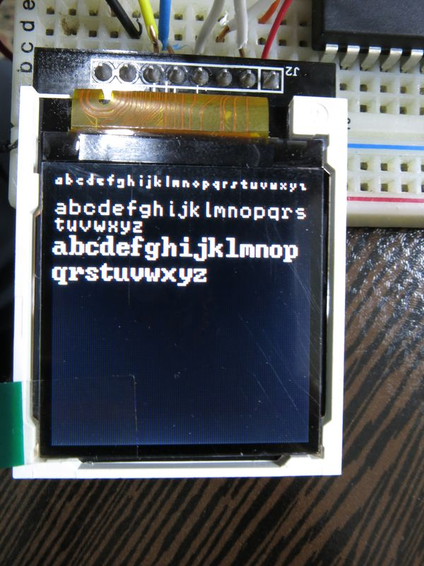

# libtft144

ILI9163C's based library connect with SPI Interface

The Original library is for 1.44" 128x128 TFT LCD, but it should work for
other ILI9163C's LCD's too, the only change is in tft144_config.h file.

## Key Features

*   drawing simple line, anti-aliased line(experimental), bezier curves, circles
*   have 3 default fonts, could add more to a library based font package, you 
	may add more font's and add them to library and easily use them
*	optimized for AVR, tested on atmega32. should support atmega16 and even atmega8 too
*	small footprint size: around 10KB code size in full feature use ( drawing functions + fonts )

For pure AVR ( no arduino or any starter board ) tft144 library
use for driving ILI9163 LCDs, converted code from Python and added
some fonts, plus drawing functions.

